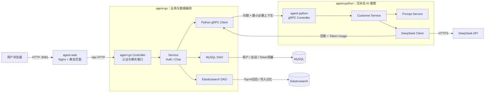

# 金融智能客服架构

## 数据归属

- MySQL 是用户、会话和模型计量的事实库，仅由 Go 服务访问。
- Elasticsearch 保存需要检索的会话记忆，仅由 Go 服务访问。
- Python 不持有数据库账号，只接收 Go 已鉴权、筛选和限制长度后的推理上下文。
- Python 将模型供应商返回的真实 Token Usage 返回给 Go，由 Go 写入 MySQL。

## 请求流程

1. Go 验证登录 Cookie，并取得可信的 `user_id`。
2. Go 在 MySQL 更新会话活跃时间。
3. Go 使用 `user_id + session_id` 从 ES 召回最多 Top-N 条相关记忆。
4. Go 通过 gRPC 将当前问题和召回结果发送给 Python。
5. Python 构造金融客服 Prompt，调用 DeepSeek，并返回回答与 Token Usage。
6. Go 将问答记忆写入 ES，将模型计量写入 MySQL，然后返回网页。

容器日志事件和查看命令见 [LOGGING.md](LOGGING.md)。
