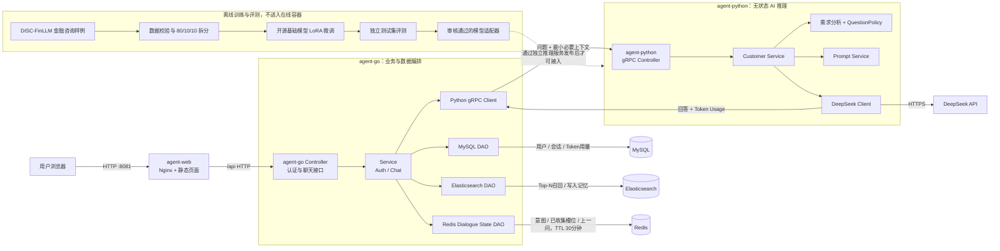

# 金融智能客服架构

## 数据归属

- MySQL 是用户、会话和模型计量的事实库，仅由 Go 服务访问。
- Elasticsearch 保存需要检索的会话记忆，仅由 Go 服务访问。
- Redis 保存当前任务进行到哪一步的短期状态，仅由 Go 服务访问；状态到期自动删除。
- Python 不持有数据库账号，只接收 Go 已鉴权、筛选和限制长度后的推理上下文。
- Python 将模型供应商返回的真实 Token Usage 返回给 Go，由 Go 写入 MySQL。
- `financial-consulting-training` 是离线工程，与三个在线服务平级；训练依赖、原始数据和模型权重不打包进 `agent-python`。
- 多轮意图、槽位和追问状态属于 Agent 服务逻辑，不属于模型权重；即使以后接入微调模型，该服务逻辑仍然保留。

## 请求流程

1. Go 验证登录 Cookie，并取得可信的 `user_id`。
2. Go 在 MySQL 更新会话活跃时间。
3. Go 使用 `user_id + session_id` 从 Redis 读取当前意图、已收集参数和上一问。
4. Go 从 ES 召回最多 Top-N 条相关长期记忆，并通过 gRPC 将问题、状态和记忆发送给 Python。
5. Python 调用 DeepSeek提取意图和本轮参数，代码完成白名单校验、跨轮合并和动态下一问选择。
6. 信息不足时 Python 返回追问和新状态；信息完整时进入对应工作流并要求 Go 清除短期状态。
7. Go 写回或删除Redis状态，将模型计量写入MySQL，并返回网页。

容器日志事件和查看命令见 [LOGGING.md](LOGGING.md)。
